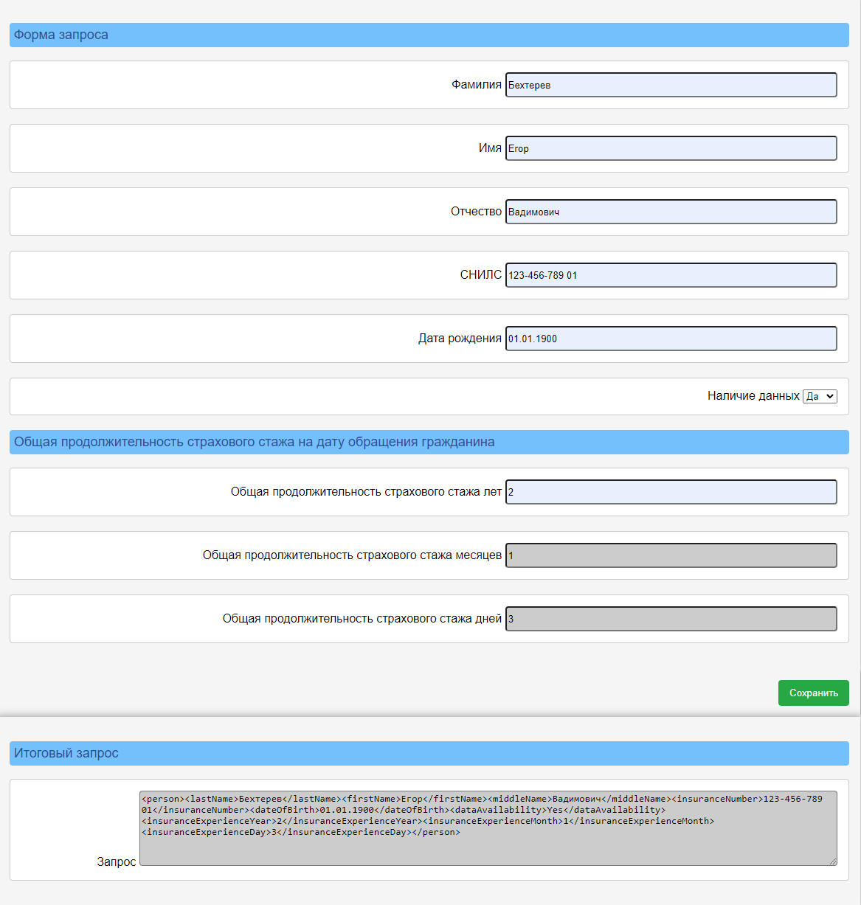

# Разработка веб-формы для персональных данных

## Описание проекта

Разработка делится на следующие этапы:

* Создать пустую HTML-страницу.
* Из описания элементов XSD схемы необходимо разработать HTML-форму.
* На элементы HTML-формы навесить валидаторы, описание которых есть в XSD схеме.
* Добавить кнопку "Сохранить", при нажатии на которую все введенные данные записываются в XML документ.
* Сформированную XML-ку вывести в поле "Запрос" раздела "Итоговый запрос".

## Стек технологий

- **HTML**
- **JavaScript**
- **CSS**

## Веб-форма:

## Ссылка на скачивание архива:
<a href="https://drive.google.com/file/d/1Ki5ozNNsdqEc65jxAteLNuzv1nnvve3s/view?usp=share_link" target="blank">архив</a>

## Контакты для связи
telegram: <a href="https://t.me/bekhterev_egor" target="blank">@bekhterev_egor</a>
